# League of Legends DATABRICKS ETL Data Pipeline 

**Simple oneshot LoL analytics pipeline built on Databricks. Over 20 different joins, and 20 million rows read.** 

1. This project was built on a set of readily available .csv from Kaggle --> [*source*](https://www.kaggle.com/datasets/nathansmallcalder/league-of-legends-match-interval-snapshots-2026/data). The dataset itself was in turn sourced from [*Raw Community Dragon*](https://raw.communitydragon.org/). 

2. This project only ingested all the raw .csv one time and run them through a medallion data pipeline. For a version of this pipeline, deployed on Snowflake, with simulated daily ingestion and incremental loading, see [*here*](https://github.com/TotoriYoyori/league-snowflake).

> *"League of Legends DATABRICKS ETL Data Pipeline" was created under Riot Games' "Legal Jibber Jabber" policy using assets owned by Riot Games. Riot Games does not endorse or sponsor this project.*

---

## Gallery

### 1. Orchestration

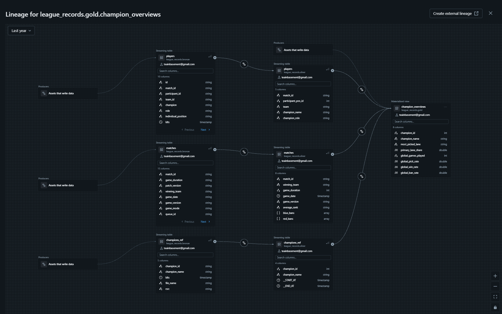
> *Lineage graph of the table `gold.champion_overviews` going from source all the way to consumption-ready state.*

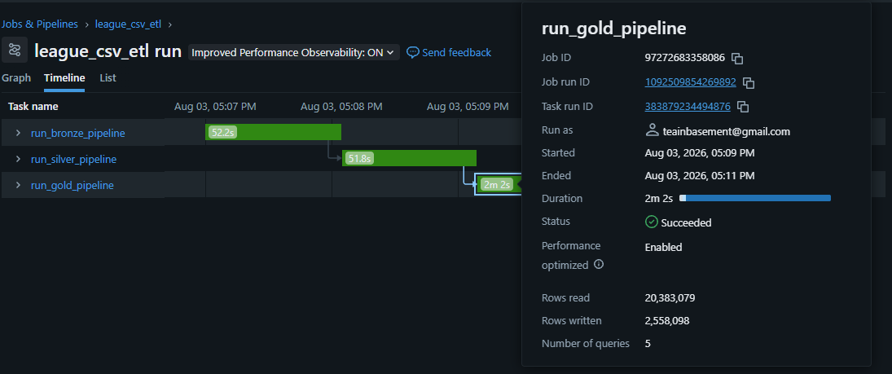
> *Timeline of the entire ETL pipeline, taking less than 5 minutes end-to-end.*

### 2. Data Showcase

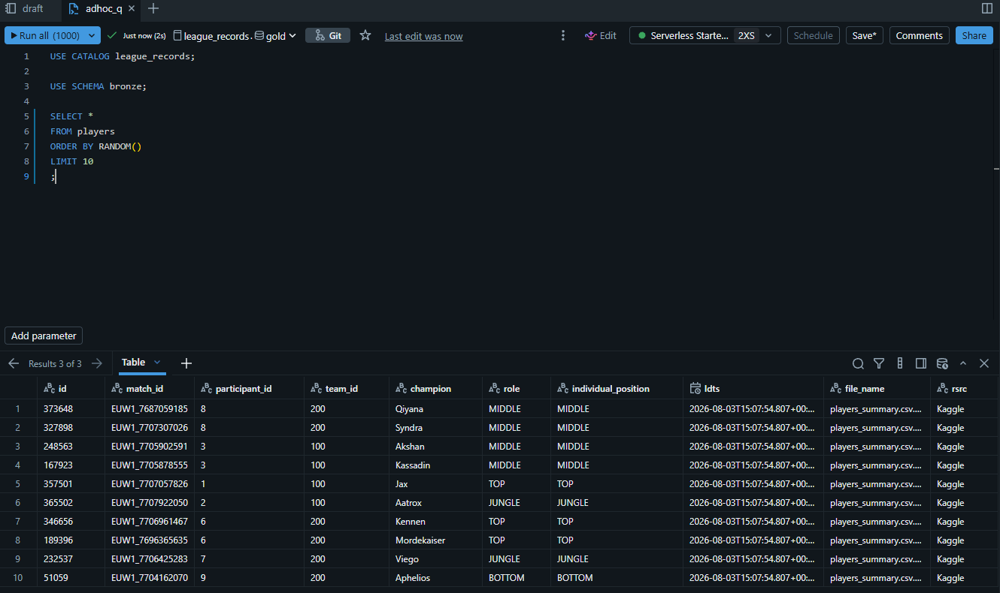
> *Querying a bronze table, showing that data is ingested by the pipeline including metadata (`ldts`, `rsrc`, `file_name`) for auditing.*

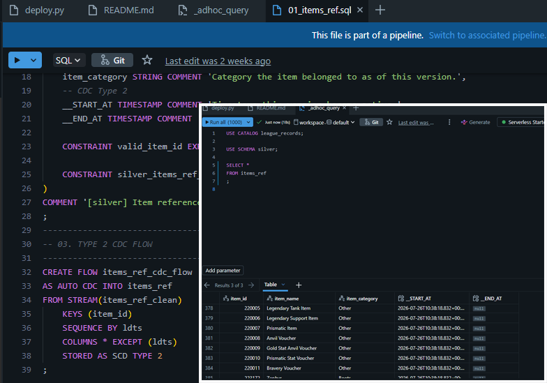
> *Change-data capture with SCD 2 for `silver.items_ref`, since items in LoL occasionally change throughout patches.*

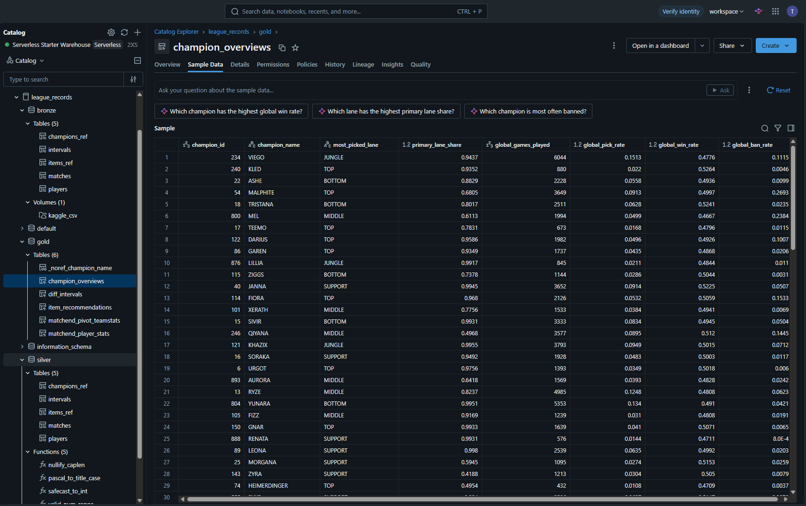
> *Live data of the same table `gold.champion_overviews` shown by the lineage graph above, as seen on Databricks catalog UI. The entire expand project schemas is also shown to the left.*

### 3. Dashboard & Insights

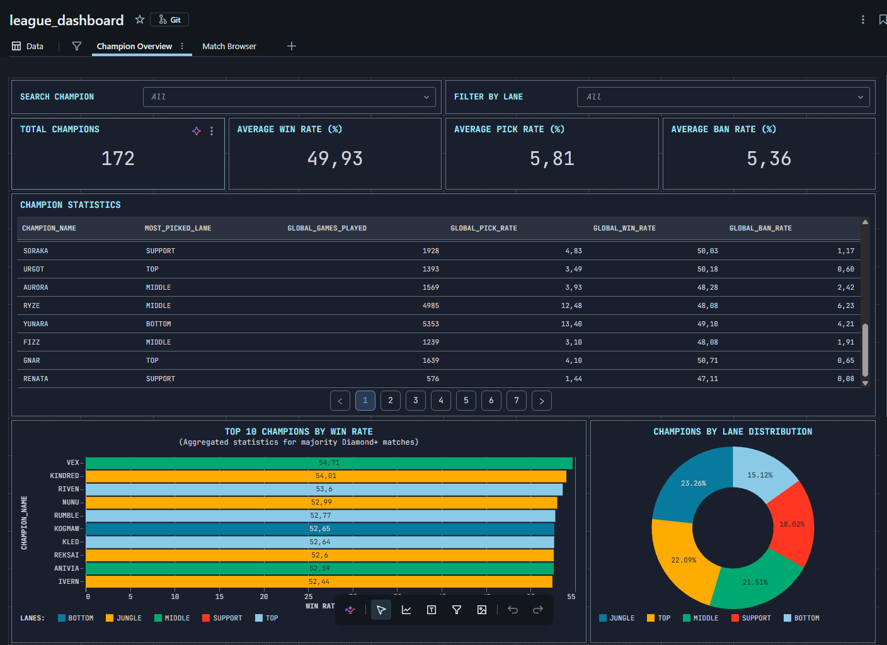
> *Simple champion overview dashboard fed by the table `gold.champion_overviews` that looks and behaves like OP.gg would, except it is freely available to in-house data team with this pipeline!*

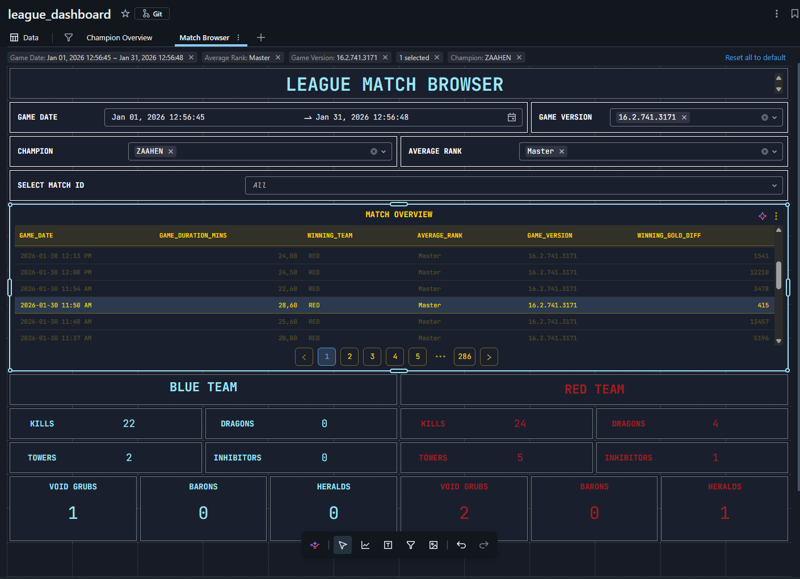
> *All dashboards are fully interactive. This is a simple dossier-style match browser that allows user to filter and view match statistics, fed by the table `gold.matchend_pivot_teamstats`*

### 4. Notebooks

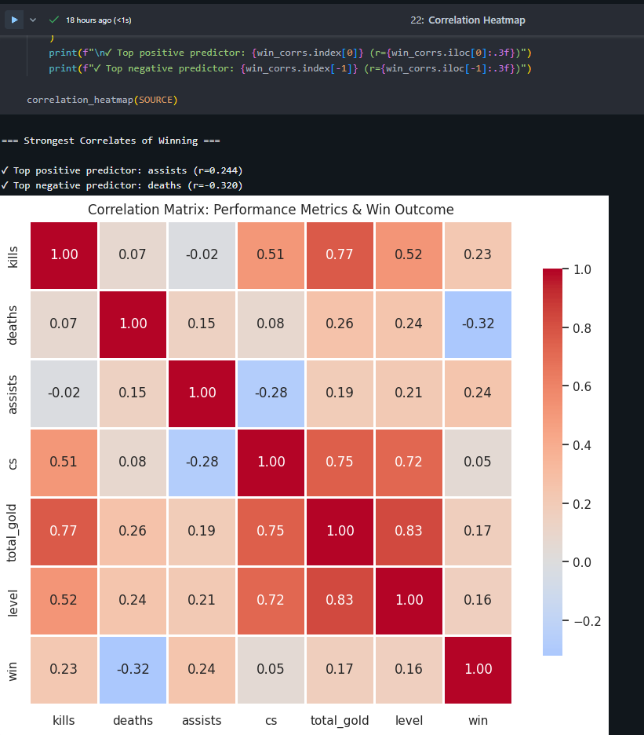
> *Sample EDA plots exploring correlation between numerical variables. A good warm-up steps before we dive into modelling works!*

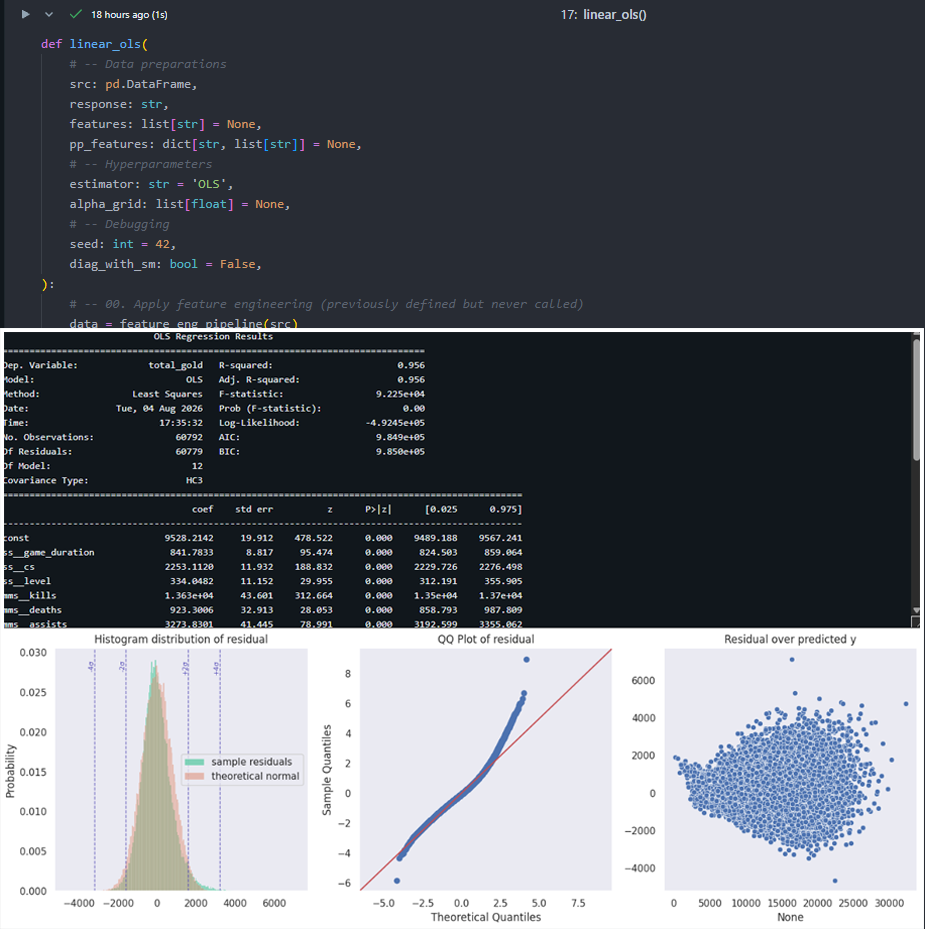
> *Fitting a simple linear regression model using statsmodels for inference, seaborn/matplotlib for visualization, and sklearn for predictions and validation.*

---

## Project Structure

```
league-databricks/
├── setup/            # All setup steps in order
├── assets/           # images and videos related to the pipeline
├── models/           # each layer shares the same structure, as shown here under bronze/
│   ├── bronze/       # Raw data ingestion
│   │   ├── transformations/       # Pipeline source code for table DDL run by Databricks.
│   │   ├── explorations/           # adhoc query for testings, dry runs and exploration
│   ├── silver/       # Cleaned & conformed data (+ shared utilities)
│   └── gold/         # Analytics-ready aggregates
│       
├── analytics/                   # Data science workflows example
│   ├── 01_sample_eda            # EDA analytics with pandas, numpy, matplotlib, seaborn
│   ├── 02_sample_modelling      # Fitting a model using sklearn
├── dashboards/       # includes: data browser and aggregation views
├── deploy.py         # One-line deployment script
└── README.md
```
---

## Prerequisites to Deploy

* A Databricks workspace with **Unity Catalog enabled** and permission to **create a catalog**.
* A startable **SQL Warehouse** (`deploy.py` looks for "Serverless Starter Warehouse" by default) as well as any **all-purpose cluster** (including Serverless).

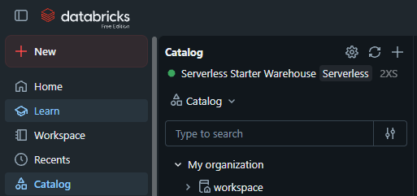

> *Info: A new DataBricks free-edition trial account will give you all the above for free!*

---

## How to Deploy Your Own Copy

1. Clone this repo into your Databricks workspace by **creating a new 'Git Folder'** in the top right and enter this repo's clone link. Keep the name of the folder as default.

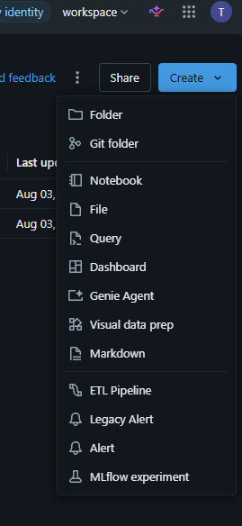   
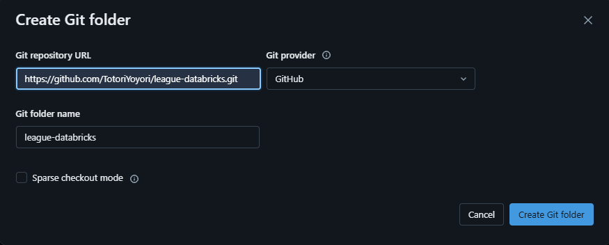
   
2. Open the **Web Terminal** (attached to Serverless or an all-purpose cluster) **at project root**. You can do this simply by opening the `deploy.py` file, click the triple dot and navigate as shown below.

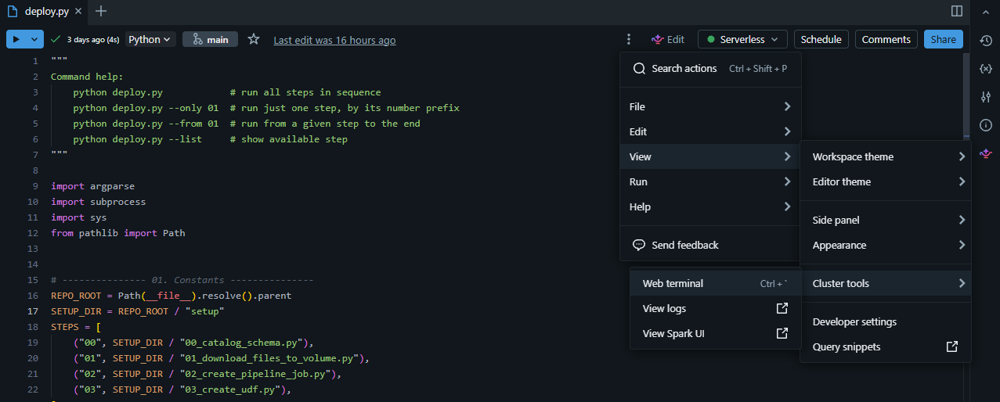 
 
3. From the **Web Terminal**, run `python deploy.py`, example below:

```bash
Workspace/Users/<your_email>@<domain.com>/league-databricks$ python deploy.py
```

You will see something like below if everything went well!

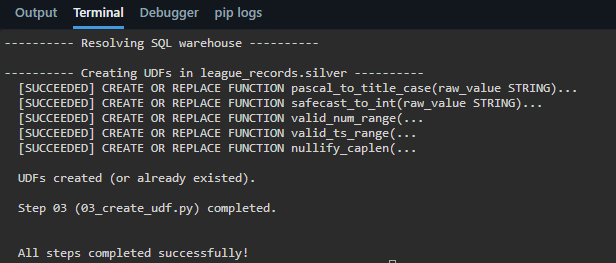

4. Go to **Jobs & Pipeline** in your sidebar to the left, click on the newly created **league_csv_etl** job, and you will see a button 'Run Now'. Click on it to start the pipeline. On your first cold start, it **might take up to 20 minutes** for the Serverless cluster to start up and finish, but subsequent warm runs usually take <= 5 minutes.
   
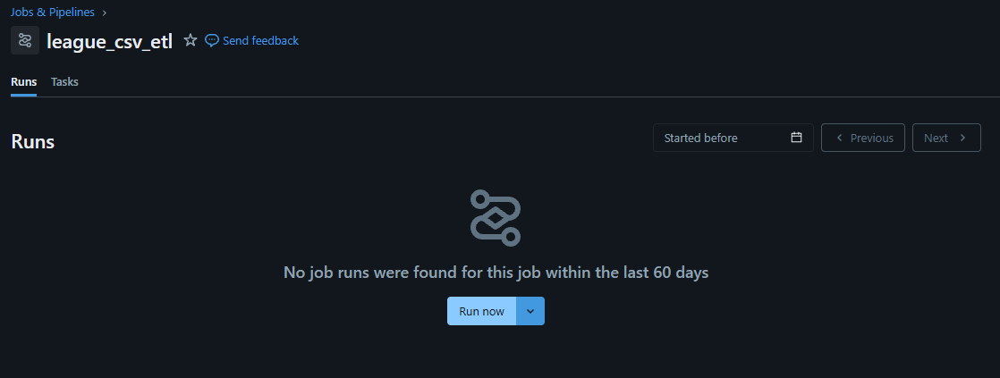

That's it! 

---

**Built with** --> Databricks | Python | SQL | 

**Python Library Used** --> Pandas | NumPy | Matplotlib | Seaborn | Sklearn | Statsmodels | Pyspark | And others...

> *If you like my work and would like to discuss employment opportunities --> **email: stan.mng@gmail.com***.
